# Development flow

How a story moves from a GitHub issue to production, with the commands and
decisions at each step. The prose version lives in `ORCHESTRATOR.md`,
`AGENTS.md` and `QUALITY.md`; this page is the map.

```mermaid
flowchart TD
    subgraph plan["1. Pick and plan"]
        issues["gh issue list / gh issue view<br/>labels: in-progress, blocked, needs-gabriel, paused"]
        owner{"Whose call?"}
        gabriel["Label needs-gabriel<br/>product, spend, infra, secrets,<br/>gate lowering, data deletion"]
        spend{"Spending flagged?"}
        paused["Label paused, file only"]
        slice{"Spans domain and UI?"}
        split["Split at the layer boundary<br/>one brief per layer"]
        tests["mechanic writes failing acceptance tests<br/>vitest / playwright"]
        issues --> owner
        owner -- "Gabriel's" --> gabriel
        owner -- "orchestrator's" --> spend
        spend -- yes --> paused
        spend -- no --> slice
        slice -- yes --> split --> tests
        slice -- no --> tests
    end

    subgraph delegate["2. Delegate"]
        size{"Agent size"}
        mechanic["mechanic (haiku)<br/>nothing to decide"]
        builder["builder (sonnet)<br/>named files, pattern, tests exist"]
        solver["solver (opus)<br/>unclear, auth, store, hedged result"]
        worktree["bun run worktree:new slug<br/>.claude/worktrees/slug"]
        brief["Brief rules: edit via Bash,<br/>commit and push early,<br/>never run_in_background"]
        tests --> size
        size --> mechanic --> worktree
        size --> builder --> worktree
        size --> solver --> worktree
        worktree --> brief
    end

    subgraph build["3. Implement and pre-push gate"]
        dev["make dev / bun run dev<br/>localhost:5173"]
        loop["bun run check<br/>bun run lint:changed<br/>bun run test:unit<br/>bun run test:e2e"]
        pre_commit["git commit -> .githooks/pre-commit<br/>format:check, check:suppressions, lint:staged"]
        verify_changed["bun run verify:changed<br/>foreground, blocks until exit<br/>writes reports/quality/gate-tier.json"]
        mut{"Mutation verdict<br/>strict per touched file"}
        new_module["Put new behavior in a new module<br/>or bun run debt:pay"]
        bundle{"check:bundle over budget?"}
        measure["Raise only with measured<br/>before/after in QUALITY.md"]
        push["git push, gh pr create<br/>body ends Closes #N"]
        brief --> dev --> loop --> pre_commit --> verify_changed
        verify_changed --> mut
        mut -- survivors --> new_module --> loop
        mut -- all killed --> bundle
        bundle -- yes --> measure --> push
        bundle -- no --> push
    end

    subgraph review["4. Review, CI, merge"]
        mechanical{"More than mechanical?"}
        reviewer["reviewer (opus, read-only)<br/>server-side auth, regression coverage,<br/>threshold rationale, 360px viewport"]
        verdict{"Verdict"}
        fix["Send fixes back to the agent"]
        claims["Orchestrator verifies claims<br/>gh pr checks n, read the diff"]
        ci["ci.yml: gate.ts ci --job ...<br/>static, unit, build, mutation-security,<br/>e2e x4 browsers, security, self-test<br/>required check: all-green"]
        green{"all-green?"}
        rerun["bun run ci:rerun-failed once,<br/>then investigate"]
        merge["gh pr merge n<br/>merge queue, no strategy flag,<br/>never update-branch"]
        push --> mechanical
        mechanical -- yes --> reviewer --> verdict
        mechanical -- no --> claims
        verdict -- "do not merge / fix" --> fix --> loop
        verdict -- merge --> claims
        claims --> ci --> green
        green -- no --> rerun --> ci
        green -- yes --> merge
    end

    subgraph after["5. After merge"]
        tag["version-tag.yml<br/>bun run version:next, patch tag"]
        qa{"main CI green?"}
        deploy_qa["bun run deploy (QA 10.10.0.198)"]
        flaky{"Any flaky e2e shard?"}
        deploy_prod["bun run deploy (prod fit-be.i.psilva.org)"]
        smoke["bun run deploy:smoke"]
        android["bun run android:release / make android"]
        done["bun run worktree:done slug<br/>gh issue comment: merged, deployed, next"]
        merge --> tag --> qa
        qa -- yes --> deploy_qa --> flaky
        flaky -- no --> deploy_prod --> smoke --> done
        flaky -- yes --> done
        deploy_qa -.-> android
    end

    subgraph scheduled["Scheduled, never gating a merge"]
        audit["mutation-audit.yml daily<br/>changed-node, changed-client, full,<br/>report:mutation-debt"]
        nightly["nightly.yml<br/>Trivy + ZAP, opens an issue on findings"]
    end

    subgraph pacing["Pacing rules on top"]
        quota["Quota meter high or Gabriel flags spend<br/>-> file and label paused"]
        bg["Agent ends turn on a background gate<br/>-> two nudges, then take over the worktree"]
        dead["Sessions die and kill agents<br/>-> pushed branches are the only durable state"]
    end
```

## Reading the map

- Diamonds are decisions the orchestrator makes. Rectangles are commands or
  agent work.
- Every gate tier is `bun scripts/quality/gate.ts <tier>` and leaves
  `reports/quality/gate-<tier>.json`. Re-run one step with `--only <step>`.
- CI is the authority. Heavy tiers (`make deep`, `bun run verify:deep`) are
  not run locally before a push; the runners judge.
- The runtime is pinned in `.tool-versions`: Node 24.18.0, Bun 1.3.9.
