# Development flow

The intended autonomous flow from a GitHub issue to production. The user
starts `workflow/go.py` manually; from there, the Python program is the
maximally deterministic driver. It owns commands, checks and lifecycle
state, and invokes agents through `aarmy` only as bounded workers. It does not
need an external Codex or Claude Code session to supervise or continuously
monitor it.

Blocks 1-5 are implemented today, from picking a story to a deployed
release: pick and plan, delegate (role selection and the pre-launch
barrier), the bounded implement/validate/correct/escalate loops ending at
the all-slice join, delivery (integration branch, PR, review, CI, merge),
and ship (the merge commit's tag, main's own CI, the QA deploy, the flaky
decision, the production deploy, the Android release and cleanup). The
prose policy behind the flow lives in `ORCHESTRATOR.md`, `AGENTS.md` and
`QUALITY.md`; this page is the map.

The [delegation and implementation gates](../workflow/delegation-contract.md)
define block 2's selection and validation rules, bounded repairs, the
block 3 join, block 4's delivery gates and block 5's ship gates.

```mermaid
flowchart TD
    user["User manually runs workflow/go.py"]
    driver["Python driver owns the lifecycle"]
    operator["Optional external operator<br/>select, start and observe only<br/>never mutate an active workflow"]
    user --> driver
    operator -.-> driver

    subgraph plan["1. Pick and plan"]
        issues["gh issue list / gh issue view<br/>labels: in-progress, blocked, needs-gabriel, paused"]
        context["Driver fetches and normalizes<br/>title, body, labels, comments and<br/>supported important timeline events<br/>stable chronological context"]
        context_size{"Context exceeds objective<br/>size threshold? (future)"}
        summarize["FUTURE — not implemented<br/>context-summarizer organizes older evidence<br/>and returns structured output"]
        validate["FUTURE — not implemented<br/>driver validates the synthesis and preserves<br/>current and recent source evidence"]
        owner{"Whose call?"}
        gabriel["Label needs-gabriel<br/>product, spend, infra, secrets,<br/>gate lowering, data deletion"]
        slice{"Spans domain and UI?"}
        split["Binary split only<br/>UI = Svelte interface/routes<br/>domain = every non-UI change,<br/>including backend/database<br/>maximum two: domain then UI"]
        worktree["Driver creates child issues and slice worktrees<br/>sequentially and deterministically"]
        mechanic_count{"One slice or two?"}
        slice_loop["For each slice: mechanic works in its<br/>isolated worktree/team<br/>same session across retries"]
        turn_validation["Validate the turn<br/>one initial + at most 2 corrective turns"]
        barrier["Driver join/barrier<br/>wait for every slice loop to settle"]
        all_succeeded{"All slices succeeded?"}
        slice_failed["Identify failed slice<br/>stop without advancing"]
        planned["Report planned<br/>advance to block 2"]
        driver --> issues --> context --> owner
        context -. "future: over threshold" .-> context_size
        context_size -. yes .-> summarize -.-> validate -.-> owner
        context_size -. "no: ordinary issue" .-> owner
        owner -- "Gabriel's" --> gabriel
        owner -- "driver's" --> slice
        slice -- yes --> split --> worktree
        slice -- no --> worktree
        worktree --> mechanic_count
        mechanic_count -- "one: one loop" --> slice_loop
        mechanic_count -- "two: one loop per slice, in parallel" --> slice_loop
        slice_loop --> turn_validation
        turn_validation -- "repairable + attempts remain" --> slice_loop
        turn_validation -- settled --> barrier
        barrier --> all_succeeded
        all_succeeded -- no --> slice_failed
        all_succeeded -- yes --> planned
    end

    subgraph delegate["2. Delegate"]
        signals["The planner extracts the nine signals<br/>with evidence; the driver validates them<br/>and applies the precedence table itself"]
        size{"Required capability?"}
        mechanic["mechanic · basic capability<br/>determined task, nothing relevant to decide"]
        builder["builder · intermediate capability<br/>specified slice, known files/area,<br/>existing tests and known pattern"]
        solver["solver · advanced capability<br/>uncertain problem or obscure cause,<br/>sensitive auth or state/store work"]
        assignment["Driver-built assignment per slice:<br/>role + agents.yaml config + signals,<br/>evidence and reason, then the<br/>pre-launch barrier for all slices"]
        launch["Pre-launch barrier for all assignments<br/>block 1 complete, valid inputs/configuration<br/>exclusive ownership and independent slices"]
        planned --> signals --> size
        size --> mechanic --> assignment
        size --> builder --> assignment
        size --> solver --> assignment
        assignment --> launch
    end

    subgraph build["3. Implement and validate"]
        implement["Per-slice agent implements in the<br/>existing isolated worktree/team<br/>first turn establishes the role session"]
        before_turn["Before each turn<br/>verify ownership, identity and attempt budget"]
        turn_gate["After turn: driver validates scope, acceptance,<br/>foreground QUALITY.md pre-push reports"]
        result{"Per-slice implementation<br/>and gates result?"}
        attempts{"Repairable and fewer than<br/>3 attempts at this level?"}
        correct["Correct with same role, agent,<br/>session and worktree"]
        can_escalate{"Role below solver?"}
        escalate["Escalate exactly one level<br/>mechanic → builder → solver"]
        preserve["Stop; preserve worktree<br/>solver exhausted or infra/auth/<br/>network/tool failure"]
        freeze["Freeze approved slice<br/>while sibling corrects or escalates"]
        delivery_barrier{"Join all settled slices<br/>all succeeded and frozen commits unchanged?"}
        implemented["Block 3 end — implemented<br/>local driver-owned commits frozen<br/>story remains in-progress"]
        push["git push, gh pr create<br/>body ends Closes #N"]
        launch -- "one loop per slice; parallel when split" --> before_turn --> implement --> turn_gate --> result
        result -- approved --> freeze --> delivery_barrier
        result -- repairable --> attempts
        result -- "external/contract/human failure" --> preserve --> delivery_barrier
        attempts -- yes --> correct --> before_turn
        attempts -- exhausted --> can_escalate
        can_escalate -- yes --> escalate --> before_turn
        can_escalate -- "no: solver" --> preserve
        delivery_barrier -- yes --> implemented --> push
        delivery_barrier -- no --> stopped["Stop and preserve all worktrees<br/>report domain then UI"]
    end

    subgraph review["4. Review, CI, merge"]
        mechanical{"More than mechanical?<br/>every slice's signals still row 4"}
        reviewer["reviewer (advanced, read-only)<br/>model resolved from configuration<br/>auth, regression coverage, thresholds, 360px"]
        verdict{"Verdict<br/>strict schema; findings must cite the diff"}
        fix["Fix turns in the affected slices<br/>same role, session and worktree<br/>re-validate, re-freeze, re-review"]
        claims["Driver verifies claims<br/>gh pr checks parsed by the driver"]
        ci["ci.yml: gate.ts ci --job ...<br/>static, unit, build, mutation-security,<br/>e2e x4 browsers, security, self-test<br/>required check: all-green"]
        green{"all-green?"}
        rerun["gh run rerun --failed once,<br/>counted in the run record"]
        merge["gh pr merge n<br/>merge queue, no strategy flag,<br/>never update-branch"]
        push --> mechanical
        mechanical -- yes --> reviewer --> verdict
        mechanical -- no --> claims
        verdict -- "do not merge / fix" --> fix
        fix --> claims
        verdict -- merge --> claims
        claims --> ci --> green
        green -- no --> rerun --> ci
        green -- yes --> merge
    end

    subgraph after["5. After merge — ship"]
        merge_sha["gh pr view --json mergeCommit<br/>the exact commit that landed"]
        tag["Wait for version-tag.yml<br/>a v* tag on origin pointing at the merge commit"]
        main_ci{"main CI green for that commit?<br/>a successful ci.yml push run on main,<br/>or a successful merge_group run for it"}
        stop_ci["TOOL_FAILED<br/>post-merge red main is a human call"]
        release_wt["release-story-n worktree at the merge commit<br/>bun run worktree:new, reset, verified clean"]
        deploy_qa["bun run deploy --tunnel<br/>FIT_DEPLOY_HOST / FIT_PUBLIC_ORIGIN name QA"]
        smoke_qa{"reports/deploy/smoke.json ok,<br/>and the live release is this commit?"}
        stop_deploy["DEPLOY_FAILED<br/>needs-gabriel, assigned, never a rollback"]
        flaky{"Flaky signal?<br/>an End-to-end job in the counted rerun, or<br/>main push red while merge_group is green"}
        ship_to{"FIT_FLOW_SHIP_TO"}
        deploy_prod["bun run deploy<br/>FIT_DEPLOY_HOST / FIT_PUBLIC_ORIGIN name prod"]
        smoke_prod{"smoke.json ok for this commit?"}
        android["bun run android:release --server-url<br/>APK path and sha256 recorded"]
        cleanup["bun run worktree:done for every slice,<br/>the integration and the release worktree<br/>child issues closed, in-progress removed"]
        shipped["gh issue comment: PR, tag, QA, prod,<br/>android, cleanup, next<br/>terminal SHIPPED"]
        merge --> merge_sha --> tag --> main_ci
        main_ci -- no --> stop_ci
        main_ci -- yes --> release_wt --> deploy_qa --> smoke_qa
        smoke_qa -- no --> stop_deploy
        smoke_qa -- yes --> flaky
        flaky -- yes --> cleanup
        flaky -- no --> ship_to
        ship_to -- qa --> cleanup
        ship_to -- prod --> deploy_prod --> smoke_prod
        smoke_prod -- no --> stop_deploy
        smoke_prod -- yes --> android --> cleanup
        cleanup --> shipped
    end

    subgraph scheduled["Scheduled, never gating a merge"]
        audit["mutation-audit.yml daily<br/>changed-node, changed-client, full,<br/>report:mutation-debt"]
        nightly["nightly.yml<br/>Trivy + ZAP, opens an issue on findings"]
    end

    subgraph resilience["Future implementation invariants"]
        bg["No background gate or operator takeover<br/>driver owns the validation verdict"]
        dead["Coordinated cancellation is FUTURE<br/>today an external interruption leaves retained<br/>state for audit; never blindly replay"]
    end
```

## Reading the map

- Diamonds are decisions the Python driver makes. Rectangles are driver
  commands or bounded agent work.
- In the Delegate block, the driver chooses the smallest role capable
  of the required judgment: uncertainty and decision load determine the rung,
  never the number of files, lines or diff size. The planner extracts the
  nine structured signals per slice with evidence — known files or area, a
  known reference pattern, open questions, sensitive areas and whether a
  technical decision is required — and the driver validates them and applies
  the precedence table itself. Mechanic
  requires defined files and procedure with no relevant decision; builder is
  the default for normal implementation with a clear objective but real
  construction left to do; solver is reserved for uncertainty about solution
  or cause, authentication, shared state/store or other sensitive technical
  work.
- The assignment contract is structured and driver-validated, with the
  chosen role, the signals or evidence used and a short justification. Its
  output also carries semantically the resolved configuration, existing
  worktree and brief into block 3, so delegation is not decided again. The
  envelope shape is the [assignment
  contract](../workflow/delegation-contract.md#assignment-envelope)
  implemented in `fitflow/assignment.py`. Immutable references avoid copying
  slice identity.
- All four roles — planner, mechanic, builder and solver — live in
  `workflow/agents.yaml`, each with backend, model and reasoning
  effort; the loader requires all four before any side effect. Python and
  the diagram do not fix model names. Seeded capacity defaults are
  basic/low for mechanic, intermediate/medium for builder and
  advanced/high for solver.
- The block 2/3 policy gives each role level one initial implementation
  attempt and up to two repairs in the same agent, session and worktree. On
  exhaustion it escalates exactly one level—mechanic to builder or builder to
  solver. An exhausted solver stops and preserves the worktree. Infrastructure,
  authentication, network and tool failures stop immediately without retry or
  capability escalation. This is separate from block 1's loop for producing
  failing acceptance tests.
- Each slice selects its role independently. Domain and UI implementation and
  gates may run in parallel in their existing worktrees. An approved slice is
  frozen while its sibling repairs or escalates; the single join/barrier is at
  the end of block 3, before delivery or PR creation, not inside Delegate.
- In the implemented path, the driver—not an agent—fetches GitHub issue
  evidence and deterministically normalizes it. Ordinary issues go straight
  from the complete normalized context to the planner; no summarizer runs
  today. The supported timeline-event set is intentionally limited to event
  types the GitHub adapter can fetch reliably.
- The dashed context-summarizer branch is entirely future architecture. If an
  objective size threshold is exceeded, it will organize older evidence into a
  structured synthesis which the driver validates, while current and recent
  source evidence remains available to the planner. The synthesis neither
  decides requirements nor overrides the issue record.
- In block 1, the driver creates each slice worktree before
  the mechanic writes its failing tests. Its slicing contract has exactly two
  categories: UI means frontend/interface work in Svelte components and routes;
  domain means every non-UI change, including framework-free logic,
  server/backend code, persistence, migrations and database work. A story gets
  one slice when wholly in either category, or at most two ordered slices—domain
  then UI—when it spans both. Block 2 reuses that same worktree, branch,
  team and issue.
- Child-issue, worktree and team setup stays sequential and deterministic.
  Then one-slice stories run one mechanic, while two-slice stories run the
  domain and UI mechanics concurrently in their isolated worktrees/teams. The
  Python driver joins the turns, validates every result, and reports planned
  only when all slices succeed; otherwise it identifies each failed slice in
  deterministic domain/UI order and does not advance.
- Block 1's test-writing loop permits three turns total: the initial turn and
  at most two corrections in the same mechanic identity, AI Army team/session,
  branch and worktree, with only the failing-acceptance-test outcomes retryable.
  Block 3's implementation loop applies the same budget to the selected role,
  reusing the block 1 team, branch, worktree and acceptance tests, and the
  driver makes the implementation commit itself and freezes the slice on
  success. Both loops rerun their complete independent validation after every
  turn; repairable failures retry, external and contract failures stop
  immediately, and exhaustion retains the last diagnostic for the terminal
  stop. Worktrees are preserved for audit; cleanup is an explicit later action.
- Block 5 runs in the same invocation, immediately after the merge, and
  believes nothing a script tells it. It reads the merge commit from the PR,
  waits for `version-tag.yml`'s tag to point at that commit, and applies
  `main-ci-gate.ts`'s own acceptance itself - a successful `ci.yml` `push`
  run on `main` for the commit, or a successful `merge_group` run for it.
  Each deploy runs in a throwaway `release-story-<n>` worktree reset to the
  merge commit, and is judged by reading `reports/deploy/smoke.json`
  afterwards: `ok`, and a passed release check naming that same commit. The
  flaky decision is what withholds production - an `End-to-end` job in
  block 4's one counted rerun, or main's `push` run red beside a green
  `merge_group` run, is the `failOnFlakyTests` signature, and an unfinished
  push run counts as flaky too. Withheld production is not a failure: the
  run still cleans up, comments and ends `SHIPPED`. A deploy that fails is
  `DEPLOY_FAILED` with `needs-gabriel`, never a rollback and never a
  `blocked` retry of blocks 1-4 - the merge has already landed.
- The deploy targets are configuration, never repository content:
  `FIT_FLOW_QA_DEPLOY_HOST`, `FIT_FLOW_QA_PUBLIC_ORIGIN` and, when
  `FIT_FLOW_SHIP_TO=prod`, `FIT_FLOW_PROD_DEPLOY_HOST` and
  `FIT_FLOW_PROD_PUBLIC_ORIGIN`. They are validated beside the agent roster
  at startup, before any side effect, so a run never merges a pull request
  and only then discovers it cannot deploy what it merged.
- Every gate tier is `bun scripts/quality/gate.ts <tier>` and leaves
  `reports/quality/gate-<tier>.json`. Re-run one step with `--only <step>`.
- CI is the authority. Heavy tiers (`make deep`, `bun run verify:deep`) are
  not run locally before a push; the runners judge.
- The runtime is pinned in `.tool-versions`: Node 24.18.0, Bun 1.3.9.
