# Development flow

The intended autonomous flow from a GitHub issue to production. The user
starts `workflow/go.py` manually; from there, the Python program is the
maximally deterministic driver. It owns commands, checks and lifecycle
state, and invokes agents through `aarmy` only as bounded workers. It does not
need an external Codex or Claude Code session to supervise or continuously
monitor it.

Blocks 1-5 are implemented today, from picking a story to a deployed
release: pick and plan, delegate (role selection and the pre-launch
barrier), the bounded implement/validate/correct/escalate loops ending at
the all-slice join, delivery (integration branch, PR, review, CI, merge),
and ship (the merge commit's tag, main's own CI, the QA deploy, the flaky
decision, the production deploy, the Android release and cleanup). The
prose policy behind the flow lives in `ORCHESTRATOR.md`, `AGENTS.md` and
`QUALITY.md`; this page is the map.

The [delegation and implementation gates](../workflow/delegation-contract.md)
define block 2's selection and validation rules, bounded repairs, the
block 3 join, block 4's delivery gates and block 5's ship gates.

```mermaid
flowchart TD
    user["User manually runs workflow/go.py"]
    driver["Python driver owns the lifecycle"]
    operator["Optional external operator<br/>select, start and observe only<br/>never mutate an active workflow"]
    user --> driver
    operator -.-> driver

    subgraph plan["1. Pick and plan"]
        issues["gh issue list / gh issue view<br/>labels: in-progress, blocked, needs-gabriel, paused"]
        context["Driver fetches and normalizes<br/>title, body, labels, comments and<br/>supported important timeline events<br/>stable chronological context"]
        context_size{"Context exceeds objective<br/>size threshold? (future)"}
        summarize["FUTURE — not implemented<br/>context-summarizer organizes older evidence<br/>and returns structured output"]
        validate["FUTURE — not implemented<br/>driver validates the synthesis and preserves<br/>current and recent source evidence"]
        owner{"Whose call?"}
        gabriel["Label needs-gabriel<br/>product, spend, infra, secrets,<br/>gate lowering, data deletion"]
        slice{"Spans domain and UI?"}
        split["Binary split of the product<br/>UI = Svelte interface/routes<br/>domain = every non-UI change,<br/>including backend/database<br/>maximum two: domain then UI<br/>workflow = the driver itself, always one slice"]
        worktree["Driver creates child issues and slice worktrees<br/>sequentially and deterministically"]
        mechanic_count{"One slice or two?"}
        slice_loop["For each slice: mechanic works in its<br/>isolated worktree/team<br/>same session across retries"]
        turn_validation["Validate the turn<br/>one initial + at most 2 corrective turns<br/>a diagnostic repeating verbatim ends the loop early"]
        barrier["Driver join/barrier<br/>wait for every slice loop to settle"]
        all_succeeded{"All slices succeeded?"}
        slice_failed["Identify failed slice<br/>stop without advancing"]
        planned["Report planned<br/>advance to block 2"]
        driver --> issues --> context --> owner
        context -. "future: over threshold" .-> context_size
        context_size -. yes .-> summarize -.-> validate -.-> owner
        context_size -. "no: ordinary issue" .-> owner
        owner -- "Gabriel's" --> gabriel
        owner -- "driver's" --> slice
        slice -- yes --> split --> worktree
        slice -- no --> worktree
        worktree --> mechanic_count
        mechanic_count -- "one: one loop" --> slice_loop
        mechanic_count -- "two: one loop per slice, in parallel" --> slice_loop
        slice_loop --> turn_validation
        turn_validation -- "repairable + attempts remain" --> slice_loop
        turn_validation -- settled --> barrier
        barrier --> all_succeeded
        all_succeeded -- no --> slice_failed
        all_succeeded -- yes --> planned
    end

    subgraph delegate["2. Delegate"]
        signals["The planner extracts the nine signals<br/>with evidence; the driver validates them<br/>and applies the precedence table itself"]
        size{"Required capability?"}
        mechanic["mechanic · basic capability<br/>determined task, nothing relevant to decide"]
        builder["builder · intermediate capability<br/>specified slice, known files/area,<br/>existing tests and known pattern"]
        solver["solver · advanced capability<br/>uncertain problem or obscure cause,<br/>sensitive auth or state/store work"]
        assignment["Driver-built assignment per slice:<br/>role + agents.yaml config + signals,<br/>evidence and reason, then the<br/>pre-launch barrier for all slices"]
        launch["Pre-launch barrier for all assignments<br/>block 1 complete, valid inputs/configuration<br/>exclusive ownership; slices independent,<br/>or the UI slice declared dependent on domain"]
        planned --> signals --> size
        size --> mechanic --> assignment
        size --> builder --> assignment
        size --> solver --> assignment
        assignment --> launch
    end

    subgraph build["3. Implement and validate"]
        implement["Per-slice agent implements in the<br/>existing isolated worktree/team<br/>first turn establishes the role session"]
        before_turn["Before each turn<br/>verify ownership, identity and attempt budget"]
        turn_gate["After turn: driver validates scope, acceptance,<br/>foreground QUALITY.md pre-push reports"]
        result{"Per-slice implementation<br/>and gates result?"}
        attempts{"Repairable, different from the previous<br/>diagnostic, and fewer than<br/>3 attempts at this level?"}
        correct["Correct with same role, agent,<br/>session and worktree"]
        can_escalate{"Role below solver?"}
        escalate["Escalate exactly one level<br/>mechanic → builder → solver"]
        preserve["Stop; preserve worktree<br/>solver exhausted or infra/auth/<br/>network/tool failure"]
        freeze["Freeze approved slice<br/>while sibling corrects or escalates"]
        dependent{"UI slice declared<br/>dependent on domain?"}
        bring_in["Driver merges the frozen domain commit<br/>into the UI branch and pushes it<br/>UI acceptance must still fail"]
        delivery_barrier{"Join all settled slices<br/>all succeeded and frozen commits unchanged?"}
        implemented["Block 3 end — implemented<br/>local driver-owned commits frozen<br/>story remains in-progress"]
        push["git push, gh pr create<br/>body ends Closes #N"]
        launch --> dependent
        dependent -- "no: independent slices" --> before_turn
        dependent -- "yes: domain first, then UI" --> before_turn
        before_turn --> implement --> turn_gate --> result
        result -- approved --> freeze --> delivery_barrier
        freeze -- "domain frozen, UI waits for it" --> bring_in --> before_turn
        result -- repairable --> attempts
        result -- "external/contract/human failure" --> preserve --> delivery_barrier
        attempts -- yes --> correct --> before_turn
        attempts -- "exhausted, or the same diagnostic twice" --> can_escalate
        can_escalate -- yes --> escalate --> before_turn
        can_escalate -- "no: solver" --> preserve
        delivery_barrier -- yes --> implemented --> push
        delivery_barrier -- no --> stopped["Stop and preserve all worktrees<br/>report domain then UI"]
    end

    subgraph review["4. Review, CI, merge"]
        mechanical{"More than mechanical?<br/>every slice's signals still row 4"}
        reviewer["reviewer (advanced, read-only)<br/>model resolved from configuration<br/>auth, regression coverage, thresholds, 360px"]
        verdict{"Verdict<br/>strict schema; findings must cite the diff"}
        fix["Fix turns in the affected slices<br/>same role, session and worktree<br/>re-validate, re-freeze, re-review"]
        claims["Driver verifies claims<br/>gh pr checks parsed by the driver"]
        ci["ci.yml: gate.ts ci --job ...<br/>static, unit, build, mutation-security,<br/>e2e x4 browsers, security, self-test<br/>required check: all-green"]
        green{"all-green?"}
        read_log["gh run view --log-failed<br/>error lines and the repository files they name"]
        located{"Does the log name a file<br/>a slice of this run owns?"}
        ci_fix["CI fix turn in the owning slice<br/>the log lines as the diagnostic<br/>re-validate, re-freeze, push<br/>at most 2 rounds, counted in the run record"]
        rerun["gh run rerun --failed once,<br/>counted in the run record"]
        self_change{"Does the diff touch workflow/?<br/>the PR changes the driver itself"}
        hand_over["NEEDS_GABRIEL<br/>needs-gabriel, assigned, PR left open,<br/>worktrees kept, never blocked"]
        merge["gh pr merge n<br/>merge queue, no strategy flag,<br/>never update-branch"]
        push --> mechanical
        mechanical -- yes --> reviewer --> verdict
        mechanical -- no --> claims
        verdict -- "do not merge / fix" --> fix
        fix --> claims
        verdict -- merge --> claims
        claims --> ci --> green
        green -- no --> read_log --> located
        located -- yes --> ci_fix --> ci
        located -- no --> rerun --> ci
        green -- yes --> self_change
        self_change -- yes --> hand_over
        self_change -- no --> merge
    end

    subgraph after["5. After merge — ship"]
        merge_sha["gh pr view --json mergeCommit<br/>the exact commit that landed"]
        tag["Wait for version-tag.yml<br/>a v* tag on origin pointing at the merge commit"]
        main_ci{"main CI green for that commit?<br/>a successful ci.yml push run on main,<br/>or a successful merge_group run for it"}
        stop_ci["TOOL_FAILED<br/>post-merge red main is a human call"]
        release_wt["release-story-n worktree at the merge commit<br/>bun run worktree:new, reset, verified clean"]
        deploy_qa["bun run deploy --tunnel<br/>recorded as started before it runs<br/>FIT_DEPLOY_HOST / FIT_PUBLIC_ORIGIN name QA"]
        smoke_qa{"reports/deploy/smoke.json, cleared before the deploy:<br/>written, ok, and the live release is this commit?"}
        stop_deploy["DEPLOY_FAILED<br/>needs-gabriel, assigned, never a rollback"]
        flaky{"Flaky signal?<br/>an End-to-end job in the counted rerun, or<br/>main push red while merge_group is green<br/>awaited only when production is the next box"}
        ship_to{"FIT_FLOW_SHIP_TO"}
        deploy_prod["bun run deploy<br/>recorded as started before it runs<br/>FIT_DEPLOY_HOST / FIT_PUBLIC_ORIGIN name prod"]
        smoke_prod{"smoke.json, cleared before the deploy:<br/>written and ok for this commit?"}
        android["bun run android:release --server-url<br/>APK kept at FIT_FLOW_HOME/releases/tag<br/>re-hashed there, path and sha256 recorded"]
        cleanup["bun run worktree:done for every slice,<br/>the integration and the release worktree<br/>branches deleted on origin once proven landed<br/>child issues closed, in-progress removed"]
        shipped["gh issue comment: PR, tag, QA, prod,<br/>android, cleanup, next<br/>terminal SHIPPED"]
        merge --> merge_sha --> tag --> main_ci
        main_ci -- no --> stop_ci
        main_ci -- yes --> ship_gate{"FIT_FLOW_SHIP_TO"}
        ship_gate -- none --> cleanup
        ship_gate -- "qa/prod" --> release_wt --> deploy_qa --> smoke_qa
        smoke_qa -- no --> stop_deploy
        smoke_qa -- yes --> flaky
        flaky -- yes --> cleanup
        flaky -- no --> ship_to
        ship_to -- qa --> cleanup
        ship_to -- prod --> deploy_prod --> smoke_prod
        smoke_prod -- no --> stop_deploy
        smoke_prod -- yes --> android --> cleanup
        cleanup --> shipped
    end

    subgraph scheduled["Scheduled, never gating a merge"]
        audit["mutation-audit.yml daily<br/>changed-node, changed-client, full,<br/>report:mutation-debt"]
        nightly["nightly.yml<br/>Trivy + ZAP, opens an issue on findings"]
    end

    subgraph recovery["Recovery: go.py n --resume / --reset"]
        resume["--resume reconciles the retained record<br/>turn ended with a reply: re-validate those bytes, no agent call<br/>turn died or never replied: void it, relaunch the same attempt<br/>no assignment: back to block 2 · PR merged: block 5"]
        refuse["Refused honestly: bytes changed, a turn still running here,<br/>a review fix interrupted, a human hold, already shipped"]
        reset["--reset removes worktrees, branches, teams,<br/>closes an open PR and the children, drops in-progress/blocked,<br/>archives runs/story-n.json"]
        resume --> refuse
    end

    subgraph resilience["Future implementation invariants"]
        bg["No background gate or operator takeover<br/>driver owns the validation verdict"]
        dead["Coordinated cancellation is FUTURE<br/>an interruption is an external stop;<br/>--resume reconciles it afterwards, never blindly replays"]
    end
```

## Reading the map

- Diamonds are decisions the Python driver makes. Rectangles are driver
  commands or bounded agent work.
- In the Delegate block, the driver chooses the smallest role capable
  of the required judgment: uncertainty and decision load determine the rung,
  never the number of files, lines or diff size. The planner extracts the
  nine structured signals per slice with evidence — known files or area, a
  known reference pattern, open questions, sensitive areas and whether a
  technical decision is required — and the driver validates them and applies
  the precedence table itself. Mechanic
  requires defined files and procedure with no relevant decision; builder is
  the default for normal implementation with a clear objective but real
  construction left to do; solver is reserved for uncertainty about solution
  or cause, authentication, shared state/store or other sensitive technical
  work.
- The assignment contract is structured and driver-validated, with the
  chosen role, the signals or evidence used and a short justification. Its
  output also carries semantically the resolved configuration, existing
  worktree and brief into block 3, so delegation is not decided again. The
  envelope shape is the [assignment
  contract](../workflow/delegation-contract.md#assignment-envelope)
  implemented in `fitflow/assignment.py`. Immutable references avoid copying
  slice identity.
- All four roles — planner, mechanic, builder and solver — live in
  `workflow/agents.yaml`, each with backend, model and reasoning
  effort; the loader requires all four before any side effect. Python and
  the diagram do not fix model names. Seeded capacity defaults are
  basic/low for mechanic, intermediate/medium for builder and
  advanced/high for solver.
- The block 2/3 policy gives each role level one initial implementation
  attempt and up to two repairs in the same agent, session and worktree. Two
  is enough when they fail the same way: a diagnostic that comes back
  identical after a corrective turn ends that role's budget on the spot,
  because the diagnostic and not the agent is what would have to change,
  and the unspent attempts are named in the log and the comment. On a spent
  budget - exhausted or ended early - it escalates exactly one
  level—mechanic to builder or builder to solver. A solver whose budget is
  spent stops and preserves the worktree. Infrastructure,
  authentication, network and tool failures stop immediately without retry or
  capability escalation at this classification level - beneath it, a `gh`
  call or an `aarmy talk` that fails with a transient signature (a GitHub
  5xx, a network blip, an empty-message backend error) already got one
  transparent retry before reaching this policy. This is separate from
  block 1's loop for producing failing acceptance tests.
- A story about the driver itself takes the third layer, `workflow`: always a
  single slice, confined to `workflow/**`, `docs/**` and `cspell.json`, with
  pytest acceptance tests under `workflow/tests/` and the driver's own gates
  (`ruff check`, `ruff format --check`, and prettier and cspell over changed
  markdown) in place of the bun lanes. Block 4 opens its pull request and
  withholds the merge: the driver never merges its own code.
- Each slice selects its role independently. Two independent slices run their
  domain and UI implementation and gates in parallel in their existing
  worktrees. A UI slice normally renders what its domain sibling supplies, so
  its acceptance tests cannot pass before that implementation exists; the
  planner declares that with `needs_sibling`, block 2 accepts it on the UI
  slice, and block 3 then runs domain first, then UI on a driver-made merge of
  the frozen domain commit - pushed, and re-checked so the UI acceptance tests
  still fail on the merged tree. The dependency never runs the other way, and
  a domain slice that never freezes leaves the UI slice unlaunched. An
  approved slice is frozen while its sibling repairs or escalates; the single
  join/barrier is at the end of block 3, before delivery or PR creation, not
  inside Delegate.
- In the implemented path, the driver—not an agent—fetches GitHub issue
  evidence and deterministically normalizes it. Ordinary issues go straight
  from the complete normalized context to the planner; no summarizer runs
  today. The supported timeline-event set is intentionally limited to event
  types the GitHub adapter can fetch reliably.
- The dashed context-summarizer branch is entirely future architecture. If an
  objective size threshold is exceeded, it will organize older evidence into a
  structured synthesis which the driver validates, while current and recent
  source evidence remains available to the planner. The synthesis neither
  decides requirements nor overrides the issue record.
- In block 1, the driver creates each slice worktree before
  the mechanic writes its failing tests. Its slicing contract has exactly two
  categories: UI means frontend/interface work in Svelte components and routes;
  domain means every non-UI change, including framework-free logic,
  server/backend code, persistence, migrations and database work. A story gets
  one slice when wholly in either category, or at most two ordered slices—domain
  then UI—when it spans both. Block 2 reuses that same worktree, branch,
  team and issue.
- Child-issue, worktree and team setup stays sequential and deterministic.
  Then one-slice stories run one mechanic, while two-slice stories run the
  domain and UI mechanics concurrently in their isolated worktrees/teams. The
  Python driver joins the turns, validates every result, and reports planned
  only when all slices succeed; otherwise it identifies each failed slice in
  deterministic domain/UI order and does not advance.
- Block 1's test-writing loop permits three turns total: the initial turn and
  at most two corrections in the same mechanic identity, AI Army team/session,
  branch and worktree, with only the failing-acceptance-test outcomes retryable.
  Block 3's implementation loop applies the same budget to the selected role,
  reusing the block 1 team, branch, worktree and acceptance tests, and the
  driver makes the implementation commit itself and freezes the slice on
  success. Both loops rerun their complete independent validation after every
  turn; repairable failures retry, external and contract failures stop
  immediately, and exhaustion retains the last diagnostic for the terminal
  stop. Worktrees are preserved for audit; cleanup is an explicit later action.
- A red check is judged from its own log before it is retried. The driver
  reads the failed jobs' log (`gh run view --log-failed`), keeps the error
  lines and the repository paths they name, and takes the two cases apart:
  a failure it located in a file one of this run's slices owns buys a CI
  fix turn in that slice - the log lines as the diagnostic, then the same
  re-validation, re-freeze and push a review fix gets, at most two rounds,
  counted in the run record as `delivery.ci_fix_rounds`. A failure it could
  not locate - no repository path in the log at all, an artifact upload 403
  or a lost runner - is the flake's case and gets the one counted rerun it
  always got. Only when the log blames nothing but a retained acceptance
  test does the run stop without trying: those bytes are immutable to every
  implementation turn, so the answer is block 1, not a fix round (#397).
- An implementation turn may change the driver's own code under
  `workflow/` - the agent edits a worktree copy, the running driver is the
  main checkout's code, and the driver's suite is CI's own "Workflow
  driver" job - but block 4 never merges such a pull request: with CI
  green, the run labels the story `needs-gabriel`, assigns it, names the
  driver files in a comment and stops at exit 11 with the PR open and the
  worktrees kept. `quality/`, `.github/` and the gate script folders
  (`scripts/ci/`, `scripts/deploy/`, `scripts/github/`, `scripts/quality/`,
  `scripts/security/`) stay out of reach of an implementation turn: they
  are the gates the work is judged by. The rest of `scripts/` is ordinary
  application tooling and a story may be about it. Reaching into a path
  that is out of reach costs a correction, not the run: the driver names
  the paths, asks for them back, and stops as `AGENT_BROKE_CONTRACT` only
  when the budget ends with the change still there.
- A stopped run is continued with `go.py <n> --resume`, which replays
  nothing: every turn the driver saw end is recorded with its reply and a
  digest of the working tree at that moment, so its verdict is re-derived
  from those exact bytes without another agent call - the way a run stopped
  by a driver defect continues once the driver is fixed. A turn the driver
  never saw end, or one that failed before it produced a reply, is voided in
  the ledger and relaunched under the same attempt number; counters never
  reset. A record with no accepted assignment goes back to block 2 on the
  failing tests block 1 already pushed; a merged PR goes straight to block
  5, where a deploy the record shows live is not repeated. It refuses when
  it cannot be honest: the worktree's bytes moved since the turn ended, a
  turn is still running on this machine, a review fix was interrupted, the
  story carries a human hold, or the run already shipped. `go.py <n>
--reset` is the destructive counterpart: it narrates each worktree's
  state, removes worktrees, branches and teams, closes an open PR and the
  child issues, drops `in-progress` and `blocked`, and archives the record
  as `runs/story-<n>.<stamp>.reset.json`. A merged PR and a human hold are
  left alone.
- Block 5 runs in the same invocation, immediately after the merge, and
  believes nothing a script tells it. It reads the merge commit from the PR,
  waits for `version-tag.yml`'s tag to point at that commit, and applies
  `main-ci-gate.ts`'s own acceptance itself - a successful `ci.yml` `push`
  run on `main` for the commit, or a successful `merge_group` run for it.
  That much always runs, because it only verifies the merge landed
  correctly and costs nothing. What happens after it is `FIT_FLOW_SHIP_TO`:
  under `none`, the default, the run skips straight to cleanup - no release
  worktree, no deploy, no flaky wait, no Android build - and the record
  says exactly why (`{"skipped": "FIT_FLOW_SHIP_TO=none"}` for `qa`, `prod`
  and `android`). Under `qa` or `prod`, each deploy runs in a throwaway
  `release-story-<n>` worktree reset to the merge commit, and is judged by
  reading `reports/deploy/smoke.json` afterwards: `ok`, and a passed
  release check naming that same commit. The flaky decision is what
  withholds production - an `End-to-end` job in block 4's one counted
  rerun, or main's `push` run red beside a green `merge_group` run, is the
  `failOnFlakyTests` signature, and an unfinished push run counts as flaky
  too. Withheld production is not a failure: the run still cleans up,
  comments and ends `SHIPPED`. A deploy that fails is `DEPLOY_FAILED` with
  `needs-gabriel`, never a rollback and never a `blocked` retry of blocks
  1-4 - the merge has already landed. `none` also ends `SHIPPED`, exit 0:
  the run completed everything it was configured to do.
- The deploy targets are configuration, never repository content, and none
  of them is required under `FIT_FLOW_SHIP_TO=none`. Under `qa` and `prod`
  alike: `FIT_FLOW_QA_DEPLOY_HOST`, `FIT_FLOW_QA_PUBLIC_ORIGIN`; under
  `prod` only, additionally `FIT_FLOW_PROD_DEPLOY_HOST` and
  `FIT_FLOW_PROD_PUBLIC_ORIGIN`. They are validated beside the agent roster
  at startup, before any side effect, so a run never merges a pull request
  and only then discovers it cannot deploy what it merged.
- Every gate tier is `bun scripts/quality/gate.ts <tier>` and leaves
  `reports/quality/gate-<tier>.json`. Re-run one step with `--only <step>`.
- CI is the authority. Heavy tiers (`make deep`, `bun run verify:deep`) are
  not run locally before a push; the runners judge.
- The runtime is pinned in `.tool-versions`: Node 24.18.0, Bun 1.3.9.
