# Development flow

The intended autonomous flow from a GitHub issue to production. The user
starts `workflow/go.py` manually; from there, the Python program is the
maximally deterministic driver. It owns commands, checks and lifecycle
state, and invokes agents through `aarmy` only as bounded workers. It does not
need an external Codex or Claude Code session to supervise or continuously
monitor it.

Only block 1, "Pick and plan", is implemented today. Blocks 2–5 describe the
target architecture, not current Python behavior. The prose policy behind the
flow lives in `ORCHESTRATOR.md`, `AGENTS.md` and `QUALITY.md`; this page is the
map.

The proposed [delegation and implementation gates](../workflow/delegation-contract.md)
define block 2's selection and validation rules, bounded repairs, and the block
3 join. They are documentation only; no future gate is implemented yet.

```mermaid
flowchart TD
    user["User manually runs workflow/go.py"]
    driver["Python driver owns the lifecycle"]
    operator["Optional external operator<br/>select, start, observe, cancel only<br/>never mutate an active workflow"]
    user --> driver
    operator -.-> driver

    subgraph plan["1. Pick and plan"]
        issues["gh issue list / gh issue view<br/>labels: in-progress, blocked, needs-gabriel, paused"]
        context["Driver fetches and normalizes<br/>title, body, labels, comments and<br/>supported important timeline events<br/>stable chronological context"]
        context_size{"Context exceeds objective<br/>size threshold? (future)"}
        summarize["FUTURE — not implemented<br/>context-summarizer organizes older evidence<br/>and returns structured output"]
        validate["FUTURE — not implemented<br/>driver validates the synthesis and preserves<br/>current and recent source evidence"]
        owner{"Whose call?"}
        gabriel["Label needs-gabriel<br/>product, spend, infra, secrets,<br/>gate lowering, data deletion"]
        slice{"Spans domain and UI?"}
        split["Binary split only<br/>UI = Svelte interface/routes<br/>domain = every non-UI change,<br/>including backend/database<br/>maximum two: domain then UI"]
        worktree["Driver creates child issues and slice worktrees<br/>sequentially and deterministically"]
        mechanic_count{"One slice or two?"}
        slice_loop["For each slice: mechanic works in its<br/>isolated worktree/team<br/>same session across retries"]
        turn_validation["Validate the turn<br/>one initial + at most 2 corrective turns"]
        barrier["Driver join/barrier<br/>wait for every slice loop to settle"]
        all_succeeded{"All slices succeeded?"}
        slice_failed["Identify failed slice<br/>stop without advancing"]
        planned["Report planned<br/>advance to block 2"]
        driver --> issues --> context --> owner
        context -. "future: over threshold" .-> context_size
        context_size -. yes .-> summarize -.-> validate -.-> owner
        context_size -. "no: ordinary issue" .-> owner
        owner -- "Gabriel's" --> gabriel
        owner -- "driver's" --> slice
        slice -- yes --> split --> worktree
        slice -- no --> worktree
        worktree --> mechanic_count
        mechanic_count -- "one: one loop" --> slice_loop
        mechanic_count -- "two: one loop per slice, in parallel" --> slice_loop
        slice_loop --> turn_validation
        turn_validation -- "repairable + attempts remain" --> slice_loop
        turn_validation -- settled --> barrier
        barrier --> all_succeeded
        all_succeeded -- no --> slice_failed
        all_succeeded -- yes --> planned
    end

    subgraph delegate["2. Delegate — FUTURE"]
        signals["FUTURE — driver derives slice signals<br/>known files/area and reference pattern<br/>open questions, sensitive area,<br/>technical decision required"]
        size{"Required capability?"}
        mechanic["mechanic · basic capability<br/>determined task, nothing relevant to decide"]
        builder["FUTURE builder · intermediate capability<br/>specified slice, known files/area,<br/>existing tests and known pattern"]
        solver["FUTURE solver · advanced capability<br/>uncertain problem or obscure cause,<br/>sensitive auth or state/store work"]
        assignment["FUTURE — validate assignment per slice<br/>role + resolved agents.yaml config<br/>worktree + brief + evidence/reason"]
        launch["Pre-launch barrier for all assignments<br/>block 1 complete, valid inputs/configuration<br/>exclusive ownership and independent slices"]
        planned --> signals --> size
        size --> mechanic --> assignment
        size --> builder --> assignment
        size --> solver --> assignment
        assignment --> launch
    end

    subgraph build["3. Implement and pre-push gate — FUTURE"]
        implement["Per-slice agent implements in the<br/>existing isolated worktree/session"]
        before_turn["Before each turn<br/>verify ownership, identity and attempt budget"]
        turn_gate["After turn: driver validates scope, acceptance,<br/>foreground QUALITY.md pre-push reports"]
        result{"Per-slice implementation<br/>and gates result?"}
        attempts{"Repairable and fewer than<br/>3 attempts at this level?"}
        correct["Correct with same role, agent,<br/>session and worktree"]
        can_escalate{"Role below solver?"}
        escalate["Escalate exactly one level<br/>mechanic → builder → solver"]
        preserve["Stop; preserve worktree<br/>solver exhausted or infra/auth/<br/>network/tool failure"]
        freeze["Freeze approved slice<br/>while sibling corrects or escalates"]
        delivery_barrier{"Join all settled slices<br/>all succeeded and frozen commits unchanged?"}
        push["git push, gh pr create<br/>body ends Closes #N"]
        launch -- "one loop per slice; parallel when split" --> before_turn --> implement --> turn_gate --> result
        result -- approved --> freeze --> delivery_barrier
        result -- repairable --> attempts
        result -- "external/contract/human failure" --> preserve --> delivery_barrier
        attempts -- yes --> correct --> before_turn
        attempts -- exhausted --> can_escalate
        can_escalate -- yes --> escalate --> before_turn
        can_escalate -- "no: solver" --> preserve
        delivery_barrier -- yes --> push
        delivery_barrier -- no --> stopped["Stop and preserve all worktrees<br/>report domain then UI"]
    end

    subgraph review["4. Review, CI, merge"]
        mechanical{"More than mechanical?"}
        reviewer["reviewer (opus, read-only)<br/>server-side auth, regression coverage,<br/>threshold rationale, 360px viewport"]
        verdict{"Verdict"}
        fix["Send fixes back to the agent"]
        claims["Driver verifies claims<br/>gh pr checks n, read the diff"]
        ci["ci.yml: gate.ts ci --job ...<br/>static, unit, build, mutation-security,<br/>e2e x4 browsers, security, self-test<br/>required check: all-green"]
        green{"all-green?"}
        rerun["bun run ci:rerun-failed once,<br/>then investigate"]
        merge["gh pr merge n<br/>merge queue, no strategy flag,<br/>never update-branch"]
        push --> mechanical
        mechanical -- yes --> reviewer --> verdict
        mechanical -- no --> claims
        verdict -- "do not merge / fix" --> fix
        verdict -- merge --> claims
        claims --> ci --> green
        green -- no --> rerun --> ci
        green -- yes --> merge
    end

    subgraph after["5. After merge"]
        tag["version-tag.yml<br/>bun run version:next, patch tag"]
        qa{"main CI green?"}
        deploy_qa["bun run deploy (QA 10.10.0.198)"]
        flaky{"Any flaky e2e shard?"}
        deploy_prod["bun run deploy (prod fit-be.i.psilva.org)"]
        smoke["bun run deploy:smoke"]
        android["bun run android:release / make android"]
        done["bun run worktree:done slug<br/>gh issue comment: merged, deployed, next"]
        merge --> tag --> qa
        qa -- yes --> deploy_qa --> flaky
        flaky -- no --> deploy_prod --> smoke --> done
        flaky -- yes --> done
        deploy_qa -.-> android
    end

    subgraph scheduled["Scheduled, never gating a merge"]
        audit["mutation-audit.yml daily<br/>changed-node, changed-client, full,<br/>report:mutation-debt"]
        nightly["nightly.yml<br/>Trivy + ZAP, opens an issue on findings"]
    end

    subgraph resilience["Future implementation invariants"]
        bg["No background gate or operator takeover<br/>driver owns the validation verdict"]
        dead["Uncertain interrupted turn: stop and preserve<br/>never blindly replay or reset attempts"]
    end
```

## Reading the map

- Diamonds are decisions the Python driver makes. Rectangles are driver
  commands or bounded agent work.
- In the future Delegate block, the driver chooses the smallest role capable
  of the required judgment: uncertainty and decision load determine the rung,
  never the number of files, lines or diff size. It derives structured signals
  per slice: known files or area, a known reference pattern, open questions,
  sensitive areas and whether a technical decision is required. Mechanic
  requires defined files and procedure with no relevant decision; builder is
  the default for normal implementation with a clear objective but real
  construction left to do; solver is reserved for uncertainty about solution
  or cause, authentication, shared state/store or other sensitive technical
  work. Builder and solver are future roles and are not implemented today.
- The target assignment contract is structured and driver-validated, with the
  chosen role, the signals or evidence used and a short justification. Its
  output also carries semantically the resolved configuration, existing
  worktree and brief into block 3, so delegation is not decided again. This is
  a future [documentary contract](../workflow/delegation-contract.md#proposed-assignment-envelope),
  not an implemented schema. Immutable references avoid copying slice identity.
- When Delegate is implemented, builder and solver will join planner and
  mechanic in `workflow/agents.yaml`, each with backend, model and reasoning
  effort. Python and the diagram do not fix model names. Suggested capacity
  defaults are basic/low for mechanic, intermediate/medium for builder and
  advanced/high for solver. The current loader intentionally accepts only the
  implemented planner and mechanic roles.
- The future block 2/3 policy gives each role level one initial implementation
  attempt and up to two repairs in the same agent, session and worktree. On
  exhaustion it escalates exactly one level—mechanic to builder or builder to
  solver. An exhausted solver stops and preserves the worktree. Infrastructure,
  authentication, network and tool failures stop immediately without retry or
  capability escalation. This is separate from block 1's already implemented
  loop for producing failing acceptance tests.
- Each slice selects its role independently. Domain and UI implementation and
  gates may run in parallel in their existing worktrees. An approved slice is
  frozen while its sibling repairs or escalates; the single join/barrier is at
  the end of block 3, before delivery or PR creation, not inside Delegate.
- In the implemented path, the driver—not an agent—fetches GitHub issue
  evidence and deterministically normalizes it. Ordinary issues go straight
  from the complete normalized context to the planner; no summarizer runs
  today. The supported timeline-event set is intentionally limited to event
  types the GitHub adapter can fetch reliably.
- The dashed context-summarizer branch is entirely future architecture. If an
  objective size threshold is exceeded, it will organize older evidence into a
  structured synthesis which the driver validates, while current and recent
  source evidence remains available to the planner. The synthesis neither
  decides requirements nor overrides the issue record.
- In the implemented block 1, the driver creates each slice worktree before
  the mechanic writes its failing tests. Its slicing contract has exactly two
  categories: UI means frontend/interface work in Svelte components and routes;
  domain means every non-UI change, including framework-free logic,
  server/backend code, persistence, migrations and database work. A story gets
  one slice when wholly in either category, or at most two ordered slices—domain
  then UI—when it spans both. Block 2 will reuse that same worktree.
- Child-issue, worktree and team setup stays sequential and deterministic.
  Then one-slice stories run one mechanic, while two-slice stories run the
  domain and UI mechanics concurrently in their isolated worktrees/teams. The
  Python driver joins the turns, validates every result, and reports planned
  only when all slices succeed; otherwise it identifies each failed slice in
  deterministic domain/UI order and does not advance. This parallel mechanic
  path is implemented in block 1.
- Each mechanic slice loop permits three turns total: the initial turn and at
  most two corrections in the same mechanic identity, AI Army team/session,
  branch and worktree. The driver reruns its complete independent validation
  after every turn. Only repairable test-work failures retry; launch,
  authentication, network, malformed runner output and other external/tooling
  failures stop immediately. Corrective prompts quote the concrete diagnostic,
  forbid product implementation, and limit edits to acceptance tests. A slice
  that succeeds is not rerun while its parallel sibling retries, and exhaustion
  retains the last diagnostic for the terminal stop. Agent and infrastructure
  failures preserve slice worktrees for audit and report whether each is clean
  or dirty; cleanup is an explicit later action.
- Every gate tier is `bun scripts/quality/gate.ts <tier>` and leaves
  `reports/quality/gate-<tier>.json`. Re-run one step with `--only <step>`.
- CI is the authority. Heavy tiers (`make deep`, `bun run verify:deep`) are
  not run locally before a push; the runners judge.
- The runtime is pinned in `.tool-versions`: Node 24.18.0, Bun 1.3.9.
